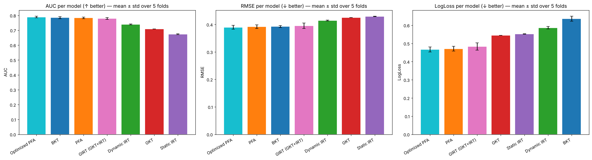
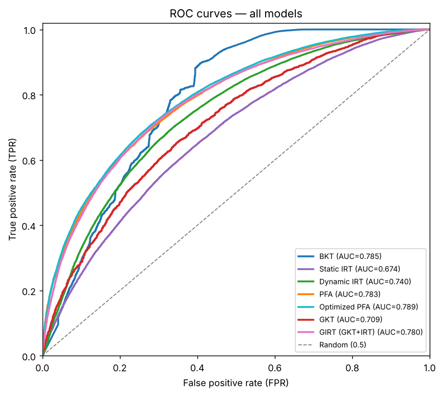

# Knowledge Tracing Benchmark

Which model best predicts whether a learner will answer the next question correctly?

This repository benchmarks **seven interpretable knowledge-tracing models** on 110k real
interactions from **Cleverlearn**, a French EdTech start-up, under one common evaluation
protocol. It was carried out by a team of five students in the Artificial Intelligence project
course at CentraleSupélec (March to June 2026).

Interpretability was a requirement of the client: every model had to keep readable parameters,
which is why black-box models such as DKT were left out.

Beyond the scores, the analysis reads each model through its pedagogical assumptions
(does knowledge decay? does practice help? do skills interact?) and links the performance gaps
to the assumptions that actually hold on this data.

> The Cleverlearn data is private and is **not** included. A synthetic dataset with the same
> schema can be generated to run every model end to end (see [Quick start](#quick-start)).



---

## Results

110,101 interactions, 267 learners, 102 skills. Mean ± standard deviation over 5 folds.

| Model | Family | AUC ↑ | RMSE ↓ | Log-loss ↓ |
|---|---|---|---|---|
| **Optimized PFA** | logistic, temporal | **0.789 ± 0.006** | **0.390** | **0.467** |
| BKT | probabilistic | 0.786 ± 0.007 | 0.393 | 0.637 |
| PFA | logistic | 0.784 ± 0.006 | 0.392 | 0.471 |
| GIRT | graph + IRT | 0.780 ± 0.006 | 0.395 | 0.484 |
| Dynamic IRT | psychometric, dynamic | 0.740 ± 0.003 | 0.415 | 0.586 |
| GKT | graph, neural | 0.709 (one fold) | 0.425 | 0.545 |
| Static IRT* | psychometric | 0.674 ± 0.003 | 0.430 | 0.553 |

\* Static IRT learns one ability per known student and is evaluated in a warm-start setting.
GKT was trained on one fold only (owing to its long training time). Full tables in [`analysis/tables/`](analysis/tables/).

**Main findings**

- Simple logistic models with item difficulty and success / failure counts (PFA family) match
  or beat more complex ones, and give the lowest log-loss.
- BKT ranks answers well (high AUC) but has the worst log-loss: its "mastery is never lost"
  assumption makes it over-confident on this data.
- On graph models, the learned skill graph is almost as good as a uniform graph: propagation
  between skills matters, its precise topology much less.
- Five extensions of the Optimized PFA all converge to the same AUC, which suggests a
  predictability ceiling around 0.79 on this dataset for this family of models.

<p align="center">
  
</p>

---

## Models

| Model | Folder | Idea |
|---|---|---|
| BKT | [`models/bkt`](models/bkt) | Hidden Markov model of mastery per skill, fitted with EM (implemented from scratch) |
| Static IRT | [`models/irt`](models/irt) | 1PL / 2PL item response theory per skill (py-irt) |
| Dynamic IRT | [`models/dynamic_irt`](models/dynamic_irt) | Ability that evolves after each answer, with a Gaussian transition prior (PyTorch) |
| PFA | [`models/pfa`](models/pfa) | Logistic regression on item difficulty and past successes / failures |
| Optimized PFA | [`models/optimized_pfa`](models/optimized_pfa) | PFA + dynamic ability (from Dynamic IRT) + forgetting and spacing features (from LKT), in PyTorch |
| GKT | [`models/gkt`](models/gkt) | Graph-based knowledge tracing (pykt-toolkit) |
| GIRT | [`models/girt`](models/girt) | Learned skill graph with a GRU state and a 2PL IRT head |

### Optimized PFA

For student $i$ answering item $j$ of skill $k$ at time $t$:

```math
\text{logit}\, P(\text{correct}) = a_j\,\big(\theta_{ik}(t) - b_j\big) + \beta \log \tau + \gamma_k \log\big(1 + w^{+}_{ik}(t)\big) + \rho_k \log\big(1 + w^{-}_{ik}(t)\big) + \delta \log\big(1 + \bar{\Delta}_{ik}(t)\big)
```

The ability $\theta_{ik}$ is updated after each answer with an ELO-like rule, past successes
$w^{+}$ and failures $w^{-}$ are weighted by an exponential forgetting term, and $\bar{\Delta}$ is
the mean gap between attempts. Overfitting is controlled by empirical-Bayes initialisation of item
difficulties, a Rasch constraint, partial pooling of per-skill parameters and early stopping on
held-out students.

---

## Evaluation protocol

- **5-fold cross-validation split by learner**: test learners are never seen in training,
  which mirrors the real use case (a new learner joins the platform).
- Every model exports its **out-of-fold predictions** in one common format
  (`fold, y_true, y_pred, skill`). A single module, [`analysis/benchmark_utils.py`](analysis/benchmark_utils.py),
  recomputes the three metrics (AUC, RMSE and log-loss) identically for every model
  and draws the comparison plots.

---

## Quick start

```bash
pip install -r requirements.txt

# 1. Generate a synthetic dataset with the real schema
python datas_management/make_synthetic_data.py

# 2. Train and cross-validate a model (from the repository root)
python -m models.pfa.pfa
python models/optimized_pfa/optimized_pfa_student_dependant.py
python -m models.bkt.bkt_launcher
python models/dynamic_irt/dynamic_irt.py
python models/girt/train.py

# 3. Export out-of-fold predictions and compare all models
python -m analysis.exporters.run_all
# then run analysis/benchmark_analysis.ipynb
```

Static IRT requires Python 3.9 to 3.11 (py-irt). GKT relies on the vendored
[pykt-toolkit](models/gkt/pykt-toolkit), see [`models/gkt/gkt_analysis.ipynb`](models/gkt/gkt_analysis.ipynb).
Results on synthetic data are only a sanity check, and running the scripts overwrites the result
files of the original experiments.

---

## Team and contributions

All five members took part in the literature review, the comparison of the models and the
improvement ideas. Main responsibilities:

| Member | Contributions |
|---|---|
| **Baptiste Alonso** | PFA and Optimized PFA (design and PyTorch implementation), five-extension ablation study, analysis of the learned coefficients, final presentation |
| Tristan Baëza | BKT and GKT, data cleaning, mid-project presentation |
| Théo Baugey | Dynamic IRT and GIRT, report, repository refactoring and documentation |
| Julien Lesguillier | Shared metrics and evaluation protocol, BKT (with T. Baëza), exploratory data analysis |
| Raphaël Pujol | Static IRT, GIRT design and analysis (with T. Baugey), evaluation of the client's model (not included here) |

Supervised by Wassila Ouerdane and Jean-Philippe Poli (CentraleSupélec), with Cleverlearn as
industry partner. Thanks to Cleverlearn for the data and for allowing this code to be published.

## References

- Corbett and Anderson (1994). *Knowledge Tracing: Modeling the Acquisition of Procedural Knowledge.*
- Pavlik, Cen and Koedinger (2009). *Performance Factors Analysis: A New Alternative to Knowledge Tracing.*
- Pavlik, Eglington and Harrell-Williams (2021). *Logistic Knowledge Tracing: A Constrained Framework for Learner Modeling.*
- Nakagawa, Iwasawa and Matsuo (2019). *Graph-based Knowledge Tracing: Modeling Student Proficiency Using Graph Neural Network.*

## License

MIT, see [`LICENSE`](LICENSE). The vendored pykt-toolkit keeps its own MIT license.
